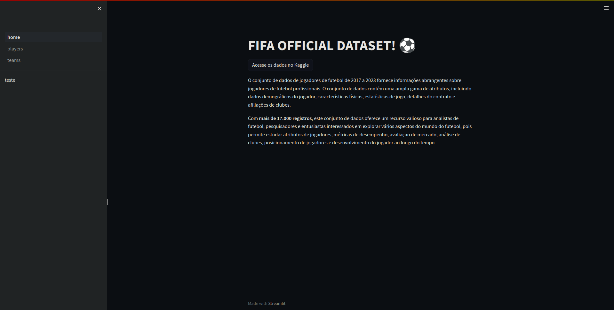
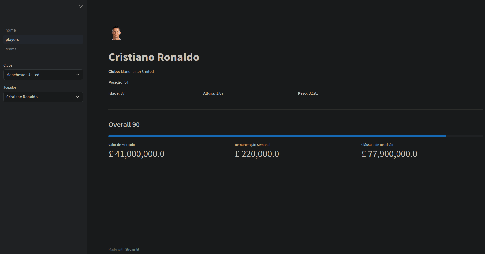
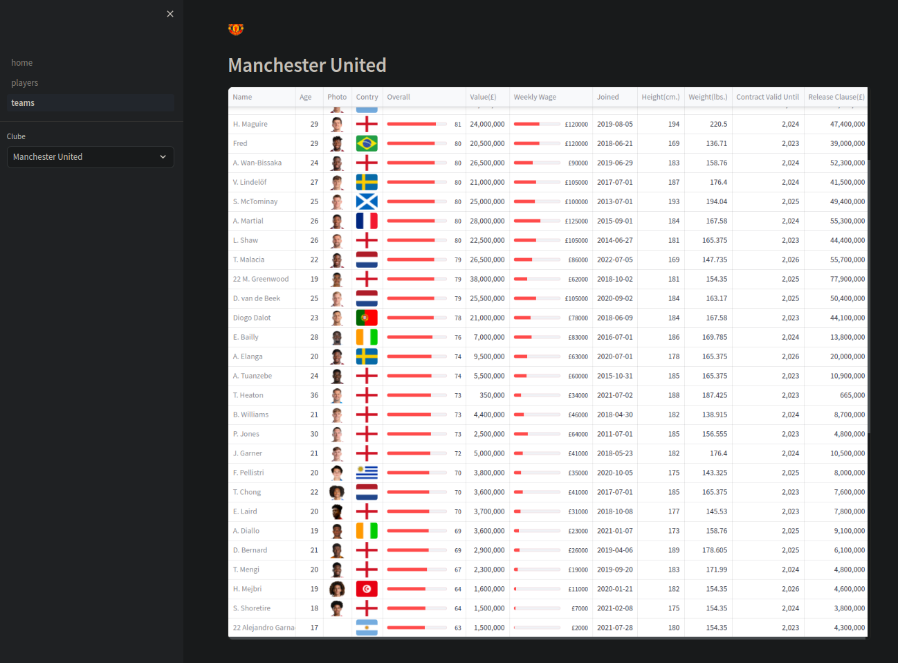

<h1 align="center"> Dash FIFA 2023 </h1>

# Streamlit é uma biblioteca Python de código aberto que facilita a criação e o compartilhamento de belos aplicativos da web personalizados para aprendizado de máquina e ciência de dados. Em apenas alguns minutos você pode criar e implantar aplicativos de dados poderosos.  

  <a href="#-tecnologias">Tecnologias</a>&nbsp;&nbsp;&nbsp;

 

  
  
  

## 🚀 Tecnologias

Esse projeto foi desenvolvido com as seguintes tecnologias:

- Python
- Git e Github
- Pandas
- Streamlit
- datetime

